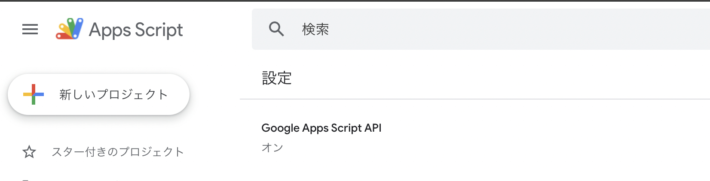
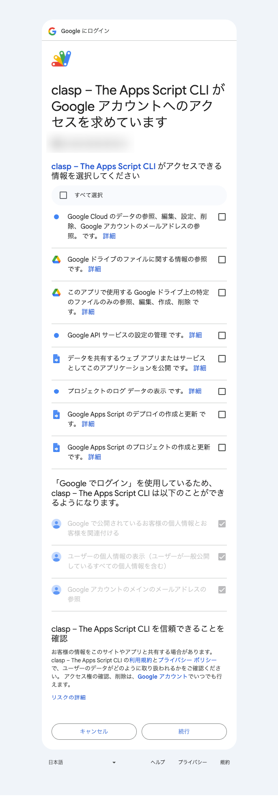
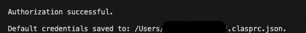
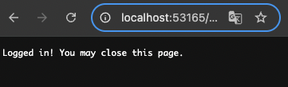
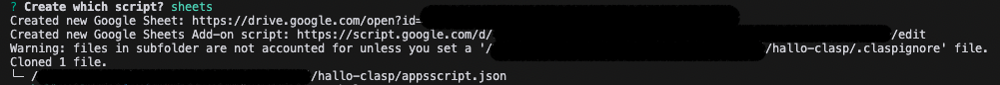
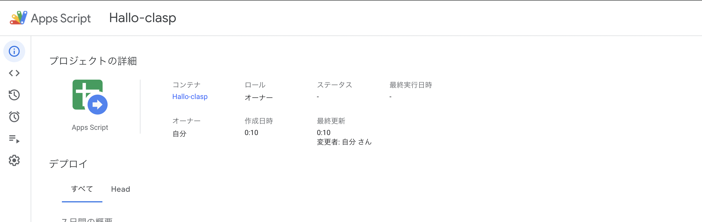

# hello-clasp

## @google/clasp Version

```sh
$ npx clasp --version
2.4.2
```

## Login

Google Apps Script APIを有効にしておく



```sh
$ npx clasp login
```

許可を求めてくるので、必要なものにチェックを入れる







成功すると、トークンが保存された `.clasprc.json` が作成される

```sh
$ ls ~/.clasprc.json
```

## Create

```sh
$ npx clasp create sample
```



成功すると、`.clasp.json` と `appsscript.json` が出来上がる。



### .clasp.json

```json
{
    "scriptId": "XXX",
    "rootDir": "src",
    "parentId": [
        "XXX"
    ]
}
```

`rootDir` は同期対象のフォルダ。  
相対パスで `src/` などを指定しておくといいだろう。

同期対象ファイルを確認する場合

```sh
$ npx clasp status
```


## Clone

既存プロジェクトが存在する場合

```sh
$ npx clasp clone [scriptId]
```

## .claspignore

除外したいファイルがあれば、`.claspignore` に書く。  
デフォルトがあるので普通にする分には不要の気がする。

```
# ignore all files…
**/**

# except the extensions…
!appsscript.json
!**/*.gs
!**/*.js
!**/*.ts
!**/*.html

# ignore even valid files if in…
.git/**
node_modules/**
```
